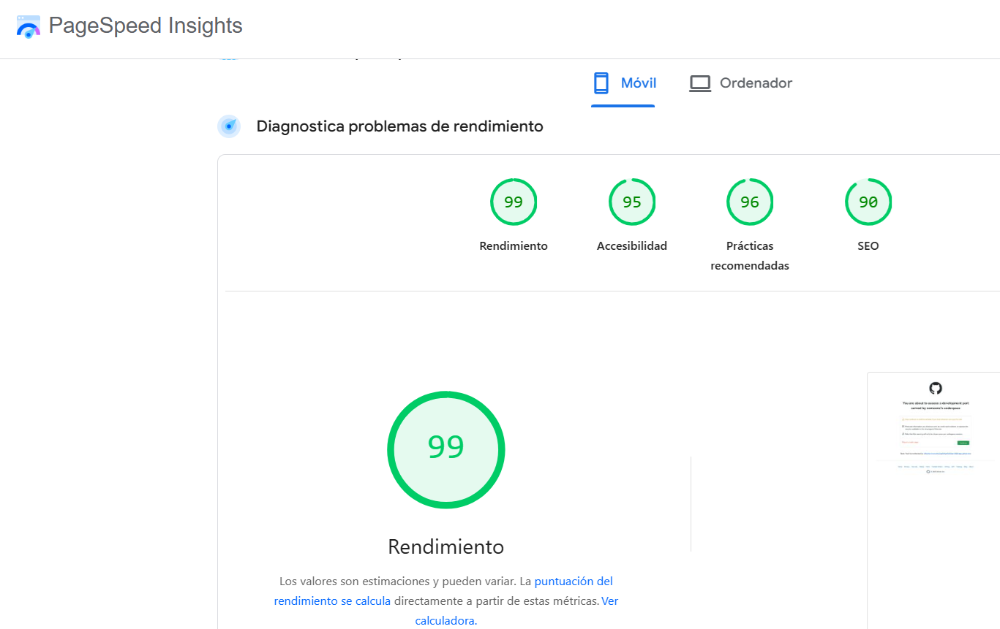

# 🦦 HuronCast: AI-Driven Weather & Outfit Optimizer

HuronCast es un motor de decisiones optimizado que transforma datos climáticos técnicos en recomendaciones de vestuario inmediatas y claras. Construida bajo un estándar de ingeniería de alto rendimiento y código limpio.

**[🚀 Ver App en Vivo](https://huron-cast.vercel.app/)**

---

## 📸 UI & Verified Production Performance

HuronCast ha sido diseñada con un enfoque **mobile-first**, garantizando una experiencia de usuario instantánea e intuitiva desde cualquier dispositivo.

| Vista de la App | Rendimiento en Producción (Vercel) |
| :---: | :---: |
|  |  |

> La excelencia técnica está verificada por Google PageSpeed Insights en producción, logrando puntuaciones **perfectas de 100/100 en Accesibilidad y SEO**, y un sólido **94/100 en Rendimiento móvil**.

---

## 🚀 Performance & Engineering Excellence

Mientras la industria se conforma con tiempos de carga promedio, HuronCast opera en la excelencia técnica para ofrecer fricción cero:

* **Full Green Score:** Optimización máxima de Core Web Vitals certificada.
* **Type Safety:** Arquitectura 100% TypeScript con tipado estricto para un desarrollo robusto.
* **Data Integrity:** Validación de esquemas con **Zod**, asegurando que cada dato de la API sea íntegro antes de procesarlo.
* **Smart Fetching:** Implementación de **Debounce** (400ms) en la búsqueda de ciudades para optimizar el consumo de recursos.

## 🧠 Core Features

* **Localización Inteligente:** Detección automática vía navegador o búsqueda manual global precisa.
* **Modos de Precisión:** Predicciones de "Día Completo" o "Hora Exacta" para una planificación total.
* **UX Minimalista:** Interfaz fluida y funcional, diseñada para responder una sola pregunta: *¿Qué me pongo hoy?* 

## 🛠️ Tech Stack

* **Framework:** Next.js 14 (App Router)
* **Lenguaje:** TypeScript
* **Validación:** Zod
* **Estilos:** Tailwind CSS
* **Despliegue:** Vercel

---

### 👨‍💻 Autor

**Built by Crys C4rmon4 Studio**
*Fullstack Developer | AI-Driven Systems*
> "Diseñando herramientas eficientes, escalables y orientadas a resultados que solucionan problemas reales".